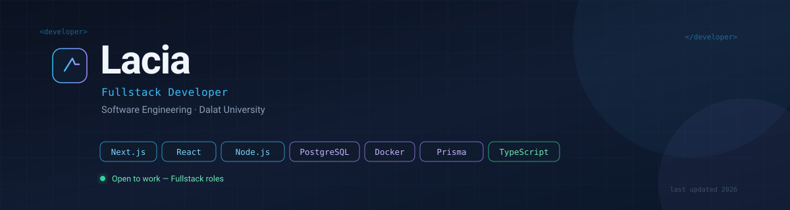

 

I build web software end to end — from database schema to the last pixel. Right now I'm finishing my degree and shipping an IT helpdesk system for my university.

 

<table>
<tr>
<td width="33%" align="center" valign="top">

**Sinh viên năm cuối**

Software Engineering 
Dalat University 
CTK46-PM

</td>
<td width="33%" align="center" valign="top">

**Thực tập sinh**

IT Center 
Dalat University 
Helpdesk system

</td>
<td width="33%" align="center" valign="top">

**Đang tìm việc**

Fullstack Developer 
Sau khi tốt nghiệp 
Open to work

</td>
</tr>
</table>

 

---

## Dự án nổi bật

<table>
<tr>
<td width="50%" valign="top">

### 🖥️ DLU OneDesk

Hệ thống quản lý helpdesk và thiết bị phòng lab cho trung tâm IT của trường đại học.

Vòng đời ticket, phân quyền theo vai trò, xác thực hai lớp, và phân loại tự động bằng Gemini API.

<a href="https://github.com/Lacia1803/dlu-onedesk">Xem repo →</a>

</td>
<td width="50%" valign="top">

### 🏋️ FitTrack

Ứng dụng theo dõi tập luyện và dinh dưỡng, cài được như PWA trên điện thoại.

Dữ liệu hoạt động offline, đồng bộ qua Supabase, tối ưu cho việc ghi chép nhanh.

<a href="https://github.com/Lacia1803/fittrack">Xem repo →</a>

</td>
</tr>
<tr>
<td width="50%" valign="top">

### 📚 DoAnWebNangCao

Hệ thống quản lý thư viện với đầy đủ CRUD, xác thực, và phân quyền người dùng.

API Node/Express kết hợp client React, đóng gói bằng Docker để triển khai dễ dàng.

<a href="https://github.com/Lacia1803/DoAnWebNangCao">Xem repo →</a>

</td>
<td width="50%" valign="top">

### 📖 Ebook2LaTeX

Công cụ Python chuyển đổi ebook sang LaTeX sạch, biên dịch được ngay.

Tự động tách chương và escape ký tự đặc biệt, không cần chỉnh tay sau khi xuất.

<a href="https://github.com/Lacia1803/Ebook2LaTeX">Xem repo →</a>

</td>
</tr>
</table>

 

---

## Công nghệ

**Ngôn ngữ**

**Frontend**

**Backend & Dữ liệu**

**Hạ tầng & Công cụ**

 

---

## Thống kê

<picture>
  <source media="(prefers-color-scheme: dark)" srcset="https://github-readme-stats.vercel.app/api?username=Lacia1803&show_icons=true&hide_border=true&include_all_commits=true&count_private=true&hide_title=true&theme=dark&bg_color=00000000&text_color=C9D1D9&icon_color=38BDF8" />
  
</picture>
<picture>
  <source media="(prefers-color-scheme: dark)" srcset="https://github-readme-streak-stats.herokuapp.com/?user=Lacia1803&hide_border=true&background=00000000&theme=dark&fire=38BDF8&ring=A78BFA&currStreakLabel=C9D1D9" />
  
</picture>

  

<picture>
  <source media="(prefers-color-scheme: dark)" srcset="https://github-readme-stats.vercel.app/api/top-langs/?username=Lacia1803&layout=compact&hide_border=true&langs_count=8&theme=dark&bg_color=00000000&text_color=C9D1D9" />
  
</picture>

 

---

<table>
<tr>
<td width="50%" valign="top">

### Liên hệ

</td>
<td width="50%" valign="top">

### Hiện tại

Sinh viên năm cuối ngành Software Engineering tại Dalat University. Đang thực tập tại trung tâm IT của trường và hoàn thành đồ án tốt nghiệp.

Sẵn sàng cho vị trí **Fullstack Developer**.

</td>
</tr>
</table>

 

*The curtain falls, but the dream goes on.*

